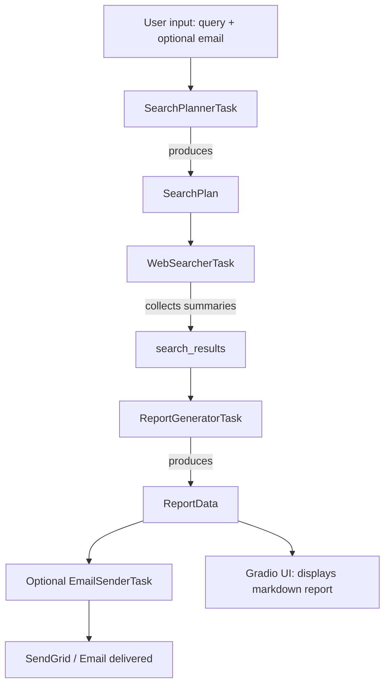

# Financial Research Agent

Educational prototype demonstrating an LLM-powered research pipeline that
performs web searches, synthesizes findings into a structured report and
optionally sends the result by email.

This repository is a study project intended to explore agent composition,
prompt engineering, and lightweight orchestration patterns. It is not
production-ready and should be used for learning and prototyping.

---

## Highlights

- Modular agent-based design: small focused agents for planning, web
  searching, writing and emailing.
- Explicit data models using Pydantic for runtime validation and clarity.
- Asynchronous pipeline that streams progress updates (async generators).
- Thin adapters for external tools (DuckDuckGo via LangChain, SendGrid).

---

## Architecture

The codebase is organized to separate responsibilities and make the
workflow clear and extensible:

- `src/core`
  - `pipeline.py`: `ResearchPipeline` executes ordered tasks and streams
    progress messages.
  - `base_agent.py` / `base_runner.py`: small wrappers that apply project
    defaults and provide typed runner helpers.

- `src/agents` — Lightweight agent wrappers that configure prompts,
  tools and model settings for each role (planner, searcher, writer,
  email sender).

- `src/runners` — Helpers that prepare prompt inputs and call typed
  runners to execute agents.

- `src/services` — Pipeline tasks that glue runners to the pipeline and
  yield progress updates for the UI.

- `src/tools` — Thin integrations with external services (search, email)
  exposed as tools for agents.

- `src/models` / `src/prompts` — Pydantic models and prompt templates keep
  data contracts and instructions explicit and reusable.

See the entrypoint at [main.py](main.py) which wires a small Gradio UI to
the pipeline.

---

## Flow Diagram



The diagram shows how `SearchPlannerTask` generates a `SearchPlan` that
the `WebSearcherTask` consumes; results flow into the `ReportGeneratorTask`
and finally reach the UI or the optional email sender.

---

## Tech Stack

- Python 3.12+
- Pydantic v2 for data validation and schemas
- Gradio for a minimal interactive UI
- OpenAI SDK (or compatible LLM backends) for language model calls
- LangChain community tools (DuckDuckGo wrapper) for web search
- SendGrid for email delivery
- `uv` used as the package manager in the development workflow

---

## What makes this project different

Rather than delegating orchestration entirely to a higher-level framework
(e.g. CrewAI), this repository implements a custom pipeline orchestrator
(`src/core/pipeline.py`) and small, composable primitives (agents,
runners, tasks, tools). This demonstrates that you understand the pieces
"under the hood": prompt orchestration, tool integration, typed
interfaces, and streaming progress updates. The custom approach keeps the
control plane explicit, easier to reason about, and simpler to adapt for
experimentation—valuable for prototyping research workflows and for
demonstrating engineering judgment.

## Robustness & Quality

This repository emphasizes clarity and learning-focused best practices:

- Type safety via Python typing and Pydantic models.
- Clear separation of concerns between agents, runners, tasks and tools.
- Logging and basic error handling around external integrations.
- The pipeline yields progress updates to improve observability and UX.

Limitations (why this is a study project):

- No exhaustive unit/integration test coverage or CI configured.
- No hardened secrets management (uses `.env` in development).
- No production-grade retry/backoff or rate-limiting policies.

---

## Requirements & Package Manager

This project uses `uv` as the package manager in the development workflow.
Use your normal `uv` workflow to sync and run the project. Example commands
you might adapt to your environment:

```bash
# Sync dependencies (depending on your uv workflow)
uv sync

# Run the application with uv
uv run python main.py
```

If you prefer standard tooling, install the dependencies with your
preferred environment manager and run `python main.py`.

---

## Configuration

- Create a `.env` (gitignored) with required API keys and configuration.
  Example variables used in development:

```
LLM_API_KEY=...
LLM_BASE_URL=...
LLM_MODEL_NAME=...
SENDGRID_API_KEY=...
SENDER_EMAIL_ADDRESS=...
```

---

## Running locally

1. Install dependencies (`uv sync` or your method).
2. Populate `.env` with API keys.
3. Run the app (`uv run python main.py` or `python main.py`).

The UI is a small Gradio app implemented in [main.py](main.py) which streams
progress while the pipeline runs and displays the final markdown report.

---

## Next Steps & Recommendations

- Add automated tests (unit + integration) and a CI pipeline.
- Run linters (e.g. `ruff`, `flake8`) and a static type checker (`mypy`).
- External call robustness: add retries, exponential backoff and
  rate-limiting controls.
- Move secrets to a secure vault for any non-local deployments.

---

## Contributing

This project is intended for study and exploration. Contributions are
welcome but please treat this repository as a learning sandbox. Open an
issue or PR with a description of what you'd like to change and the
benefits it brings.

---

_This repository is an educational prototype and not intended for
production use._