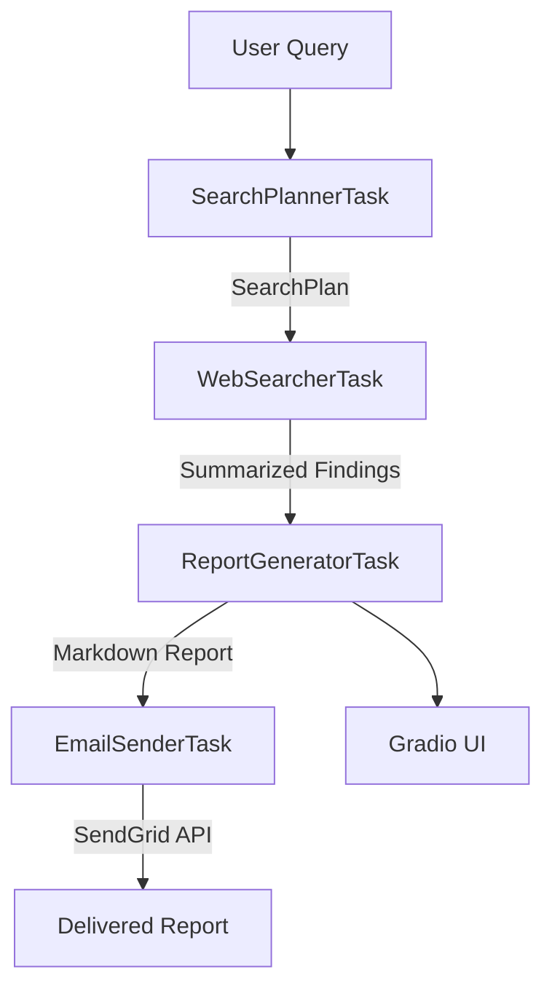

# 📊 Financial Research Agent

[](https://www.python.org/)
[](tests/)
[](src/)

An advanced LLM-powered autonomous research pipeline designed to perform deep market analysis, synthesize findings into structured reports, and deliver them via email.

> [!NOTE]  
> This is a **high-standard study project** developed as part of my career transition into **AI Engineering**. It focuses on demonstrating technical excellence in agent orchestration, asynchronous systems, and professional testing standards.

---

## 🌟 Project Highlights

- **100% Test Coverage**: A robust test suite covering every line of code, including complex asynchronous generators, Gradio UI bridges, and decorated tools.
- **Custom Orchestration Engine**: Built from the ground up to demonstrate deep understanding of LLM orchestration, avoiding high-level abstractions like CrewAI to maintain full control over the "under-the-hood" logic.
- **Asynchronous Streaming**: Implements `async` generators to provide real-time progress updates to the UI, ensuring a premium user experience.
- **Type-Driven Development**: Uses **Pydantic v2** for rigorous runtime data validation and clear contract definitions between agents.
- **Modular SOLID Architecture**: Clearly separated responsibilities between Agents, Runners, Tasks, and Tools for maximum extensibility.

---

## 🏗️ Architecture & Component Logic

The project follows a modular pattern where responsibilities are decoupled:

- **`src/core`**: The heart of the system. Contains the `ResearchPipeline` (orchestrator) and base abstractions.
- **`src/agents`**: Specialized LLM wrappers with dedicated prompts and tool configurations.
- **`src/runners`**: Execution logic that handles prompt formatting and LLM communication.
- **`src/services/tasks`**: Pipeline-ready units that glue runners to the orchestrator.
- **`src/tools`**: Clean adapters for external APIs (DuckDuckGo Search, SendGrid Email).

### Execution Flow



---

## 🛠️ Tech Stack

- **Core**: Python 3.12+, `asyncio`
- **AI/LLM**: OpenAI (or compatible providers), LangChain (Tools)
- **Validation**: Pydantic v2
- **UI**: Gradio
- **Integrations**: SendGrid (Email), DuckDuckGo (Search)
- **DevOps/Tooling**: `uv` (Package Manager), `pytest`, `pytest-cov`, `ruff`

---

## 🐳 Running with Docker

For a consistent and isolated environment, you can run the agent using Docker.

### Using Docker Compose (Recommended)
The project includes a `docker-compose.yml` that handles environment variables and volume persistence:

```bash
# Build and start the container
docker-compose up --build
```

The UI will be available at `http://localhost:7860`.

### Using Docker directly
```bash
# Build the image
docker build -t financial-agent .

# Run the container (passing .env file)
docker run -p 7860:7860 --env-file .env financial-agent
```

---

## 🛠️ Developer Productivity (Makefile)

The project includes a `Makefile` to automate common developmental tasks:

- `make install`: Sync dependencies with `uv`.
- `make run`: Launch the application locally.
- `make test`: Run the full test suite.
- `make coverage`: run tests and verify **100% coverage**.
- `make lint` / `make format`: Ensure high code quality standards.
- `make compose-up`: Deploy instantly via Docker Compose.

---

## 🚀 Engineering Standards

### Professional Testing
One of the core objectives was to achieve **100% code coverage**. This involved advanced testing techniques:
- **Decorator Patching**: Testing functions wrapped in AI-framework decorators by dynamically patching them during test collection.
- **UI Mocking**: Verifying complex Gradio block assemblies without side effects.
- **Async Verification**: Rigorous testing of asynchronous streams and task sequencing.

### Clean Code & Design
- **Separation of Concerns**: Logic is never coupled to the UI or specific tool implementations.
- **Explicit Instruction**: System prompts are managed in a dedicated module for versioning and clarity.
- **Dependency Injection**: The `ReportManager` uses DI to remain agnostic of the specific pipeline implementation.

---

## 🏁 How to Run

### Installation
This project uses [uv](https://github.com/astral-sh/uv) for lightning-fast dependency management:

```bash
# Sync environment
uv sync
```

### Configuration
Create a `.env` file (see `.env.example`):
```env
LLM_API_KEY=your_key
LLM_BASE_URL=your_url
LLM_MODEL_NAME=gpt-4o
SENDGRID_API_KEY=your_key
SENDER_EMAIL_ADDRESS=your_email@domain.com
```

### Execution
```bash
# Start the Gradio UI
uv run python main.py
```

### Running Tests
```bash
# Execute suite with coverage report
uv run pytest --cov=. --cov-report=term-missing
```

---

## ✒️ About This Project
This repository is an educational prototype demonstrating the bridge between traditional software engineering and the emerging field of **AI Engineering**. It serves as a portfolio piece to showcase my ability to build robust, testable, and maintainable AI-agentic systems.

_Developed with 💡 and ☕ for the AI community._